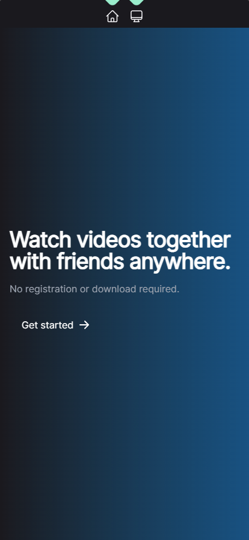
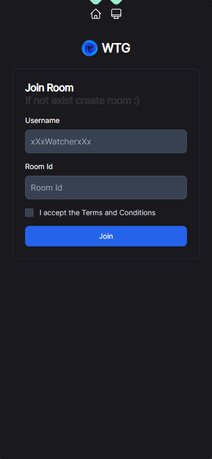
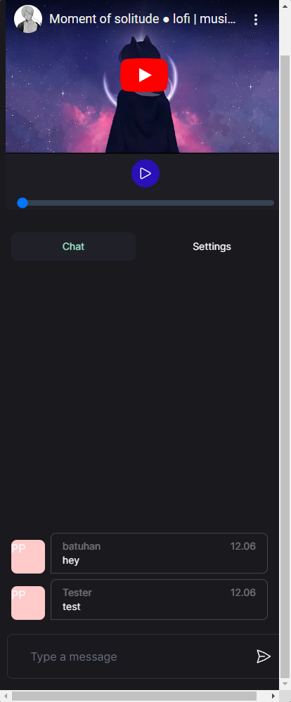
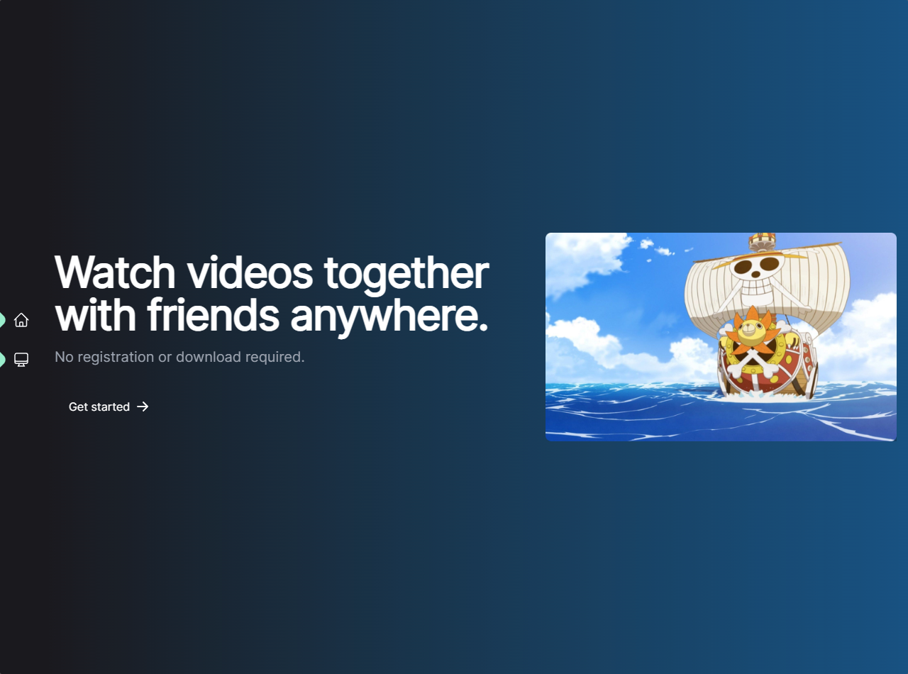
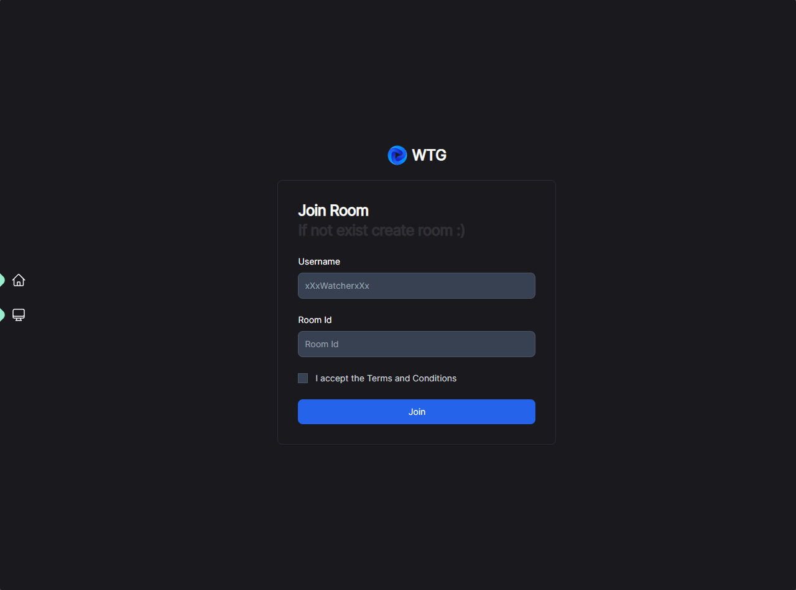
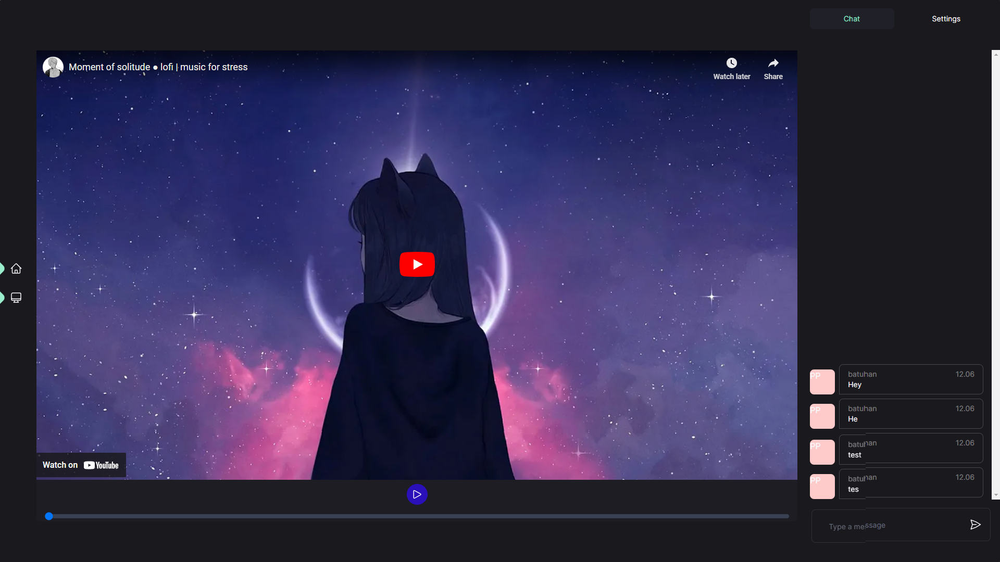

# Watch together

a tiny app to watch anime / video / movies together with friends.

Demo : https://wtg.batusan.dev


## Run Locally

Clone the project

```bash
  git clone https://github.com/batusan/Watch-Together
```

Go to the project directory

```bash
  cd Watch-Together
```

Install dependencies

```bash
  npm install
```

Start the server

```bash
  npm run dev
```

<details>
  <summary>Screenshots</summary>
  
## Mobile Screenshots





## Desktop Screenshots





</details>


